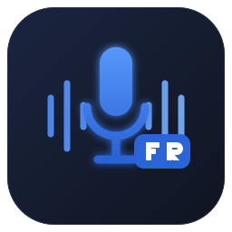

<div align="center">



# French Voice Transcription

**Turn your French speech into text — high accuracy, 100% on your machine.**

A simple, modern desktop app powered by
[faster-whisper](https://github.com/SYSTRAN/faster-whisper) and OpenAI Whisper's
`large-v3` model. Your audio files never leave your computer.

<br/>

**🌍 Language:** **English** · [Français](#-français)

<br/>

[](https://github.com/Adrien10200/transcription-vocale-fr/actions/workflows/build-release.yml)
[](https://github.com/Adrien10200/transcription-vocale-fr/releases/latest)
[](https://github.com/Adrien10200/transcription-vocale-fr/releases)

[](https://www.python.org/)
[](https://doc.qt.io/qtforpython/)
[](https://github.com/SYSTRAN/faster-whisper)
[](#)
[](LICENSE)
[](#)

</div>

---

## ✨ Features

- 🎯 **High French accuracy** — `large-v3` model, beam search, temperature fallback, voice-activity detection (VAD).
- 🖱 **Drag & drop** an audio/video file, or click to browse.
- 🔒 **100% offline** — no data ever leaves your machine.
- ⚡ **Fluid interface** — transcription runs in the background, text streams in live, and everything is **cancellable**.
- 📋 **Copy / Save** the result in one click (`.txt` or `.srt` subtitles).
- 📝 **Custom corrections** — teach the app your vocabulary (e.g. `Volio` → `Voelio`); replacements are applied automatically and **persist across upgrades**.
- 🗣 **Speaker identification** — optional lightweight diarization tags turn-taking (`Interlocuteur 1 / 2…`) in conversations, fully offline.
- 📦 **Installer** — one-click setup; the model cache is stored **outside** the app folder, so updates never re-download the ~3 GB model.
- 🎨 **3 themes** — 🌙 Dark · ☀️ Light · 🎃 Halloween.
- 🌍 **Bilingual UI** — switch between English and French with one click.
- 🎬 **Many formats** — MP3, WAV, M4A, FLAC, OGG, MP4, MKV, MOV… (audio decoding built in via PyAV, no external ffmpeg).
- 🪶 **Lightweight** — ~270 MB app (down from 750 MB), plus the model cache.

---

## 🚀 Installation (end user)

1. Open the [**Releases**](https://github.com/Adrien10200/transcription-vocale-fr/releases/latest) tab.
2. Download `Transcription-Vocale-FR-…-win64.zip`.
3. Unzip it anywhere.
4. Double-click **`Transcription Vocale FR.exe`**.

> 💡 **First launch:** the `large-v3` model (~3 GB) is downloaded automatically and
> cached in `%LOCALAPPDATA%\TranscriptionVocaleFR\models`. Subsequent launches
> are instant, and **upgrading the app never re-downloads the model** — the cache
> lives outside the app folder.

### ⚠️ Windows SmartScreen warning

The app is signed with a **self-signed certificate**, so Windows shows a blue
**“Windows protected your PC”** screen the first time, and SmartScreen displays
**Publisher: Unknown**. This is normal: a self-signed certificate is not issued
by a trusted certificate authority, so Windows cannot verify the publisher.
Removing this would require a paid OV/EV code-signing certificate. To run the app:

1. Click **More info**.
2. Click **Run anyway**.

The app is open-source — you can review every line here. Once installed, use the
**Check for updates** button inside the app: it downloads and installs new
versions automatically (no manual download).

---

## 🖥 Usage

| Step | Action |
|:----:|--------|
| **1** | **Drag** your audio file onto the drop zone (or click to browse). |
| **2** | Pick the quality — default is **Best quality (large-v3)**. |
| **3** | Click **Transcribe**. Text streams in live. |
| **4** | **Copy** or **Save** the result when done. |

Theme (Dark / Light / Halloween) and language (EN / FR) can be changed at any time
from the top-right corner.

---

## 🧠 Why it's accurate

The app is tuned for **maximum quality**, not speed:

| Setting                       | Effect |
|-------------------------------|--------|
| `large-v3` model              | The most accurate of the Whisper family. |
| Forced language `fr`          | Avoids language-detection errors. |
| `beam_size = 8`               | Wide beam search → safer decoding. |
| Temperature fallback          | Retries on repetitive/incoherent output. |
| **VAD** filter (Silero)       | Strips silences → fewer hallucinations. |
| `condition_on_previous_text`  | Keeps context between segments. |

On a machine without an NVIDIA GPU, inference runs on **CPU** in `int8`
(the sweet spot between accuracy and memory).

---

## 🛠 Development (from source)

```powershell
# 1. Clone
git clone https://github.com/Adrien10200/transcription-vocale-fr.git
cd transcription-vocale-fr

# 2. Virtual environment
python -m venv .venv
.\.venv\Scripts\Activate.ps1

# 3. Dependencies (PyAV bundles FFmpeg — no external ffmpeg needed)
pip install -r requirements.txt

# 4. Run
python app.py
```

### Command line (no GUI)

```powershell
python transcribe.py "C:\path\to\audio.mp3"      # one file
python transcribe.py "C:\audio_folder" --srt      # whole folder + subtitles
```

Options: `--model`, `--language`, `--beam-size`, `--compute-type`, `--prompt`,
`--output`. See `python transcribe.py --help`.

---

## 📦 Build the executable

```powershell
pip install -r requirements-build.txt
python -m PyInstaller --noconfirm --clean app.spec
# Output: dist/Transcription Vocale FR/Transcription Vocale FR.exe
```

The [GitHub Actions CI](.github/workflows/build-release.yml) does the same and
publishes a **release** on every `v*` tag:

```powershell
git tag v1.0.0
git push origin v1.0.0
```

---

## 🗂 Project structure

```
├── app.py                 # GUI application (PySide6) + themes + i18n + icon
├── transcriber_core.py    # Transcription core (faster-whisper)
├── transcribe.py          # Command-line interface
├── app.spec               # PyInstaller build recipe
├── assets/                # icon.svg / icon.ico / icon.png
├── requirements.txt       # Runtime dependencies
├── requirements-build.txt # Build dependencies
├── tools/                 # Optional local tooling (not versioned)
├── models/                # Model cache (~3 GB, not versioned)
└── .github/workflows/     # CI: Windows build + release
```

---

## ❓ FAQ

<details>
<summary><b>Why is the first launch slow?</b></summary>
<br/>
The <code>large-v3</code> model (~3 GB) downloads once. After that, only the
transcription time matters.
</details>

<details>
<summary><b>Does it work without an Internet connection?</b></summary>
<br/>
Yes, once the model is downloaded. No audio data is ever sent online.
</details>

<details>
<summary><b>Which formats are supported?</b></summary>
<br/>
Anything ffmpeg can decode: MP3, WAV, M4A, AAC, FLAC, OGG, OPUS, WMA, MP4, MKV,
MOV, AVI, WEBM…
</details>

---

## 📄 License

Released under the [MIT](LICENSE) license.

Built on [faster-whisper](https://github.com/SYSTRAN/faster-whisper) ·
[OpenAI Whisper](https://github.com/openai/whisper) ·
[PySide6](https://www.qt.io/qt-for-python) ·
[ffmpeg](https://ffmpeg.org/).

<br/>

---

<a name="-français"></a>

<div align="center">

# 🇫🇷 Français

**🌍 Langue :** [English](#french-voice-transcription) · **Français**

</div>

Transcrivez votre voix française en texte — haute précision, 100 % en local.
Application de bureau simple et moderne, propulsée par
[faster-whisper](https://github.com/SYSTRAN/faster-whisper) et le modèle
`large-v3` d'OpenAI Whisper. Vos fichiers audio ne quittent jamais votre ordinateur.

### ✨ Fonctionnalités

- 🎯 **Haute précision en français** — modèle `large-v3`, recherche par faisceau, repli sur la température, détection d'activité vocale (VAD).
- 🖱 **Glisser-déposer** un fichier audio/vidéo, ou cliquer pour parcourir.
- 🔒 **100 % hors ligne** — aucune donnée ne quitte votre machine.
- ⚡ **Interface fluide** — transcription en arrière-plan, texte affiché en direct, **annulable** à tout moment.
- 📋 **Copier / Enregistrer** le résultat en un clic (`.txt` ou sous-titres `.srt`).
- 📝 **Corrections personnalisées** — apprenez votre vocabulaire à l'app (ex. `Volio` → `Voelio`) ; les remplacements sont appliqués automatiquement et **conservés après une mise à jour**.
- 🗣 **Identification des interlocuteurs** — diarisation légère optionnelle qui marque les tours de parole (`Interlocuteur 1 / 2…`), 100 % hors-ligne.
- 📦 **Installeur** — installation en un clic ; le cache du modèle est stocké **hors** du dossier de l'app, donc les mises à jour ne re-téléchargent jamais les ~3 Go.
- 🎨 **3 thèmes** — 🌙 Sombre · ☀️ Clair · 🎃 Halloween.
- 🌍 **Interface bilingue** — basculez entre anglais et français en un clic.
- 🎬 **Multi-formats** — MP3, WAV, M4A, FLAC, OGG, MP4, MKV, MOV… (décodage intégré via PyAV, sans ffmpeg externe).
- 🪶 **Léger** — application ~270 Mo (au lieu de 750 Mo), plus le cache du modèle.

### 🚀 Installation (utilisateur final)

1. Ouvrez l'onglet [**Releases**](https://github.com/Adrien10200/transcription-vocale-fr/releases/latest).
2. Téléchargez `Transcription-Vocale-FR-…-win64.zip`.
3. Décompressez-le où vous voulez.
4. Double-cliquez sur **`Transcription Vocale FR.exe`**.

> 💡 **Premier lancement :** le modèle `large-v3` (~3 Go) est téléchargé
> automatiquement puis mis en cache dans `%LOCALAPPDATA%\TranscriptionVocaleFR\models`.
> Les fois suivantes sont immédiates, et **mettre à jour l'application ne
> re-télécharge jamais le modèle** — le cache est stocké hors du dossier de l'app.

#### ⚠️ Avertissement Windows SmartScreen

L'app est signée avec un **certificat auto-signé** : Windows peut afficher un
écran bleu **« Windows a protégé votre ordinateur »** au premier lancement.
C'est normal pour une application non signée par une autorité commerciale.
Pour l'exécuter : cliquez sur **Informations complémentaires** puis
**Exécuter quand même**. Utilisez le bouton **Vérifier les mises à jour** dans
l'app pour obtenir les nouvelles versions.

### 🖥 Utilisation

| Étape | Action |
|:-----:|--------|
| **1** | **Glissez** votre fichier audio sur la zone (ou cliquez pour parcourir). |
| **2** | Choisissez la qualité — par défaut **Qualité max (large-v3)**. |
| **3** | Cliquez sur **Transcrire**. Le texte apparaît en direct. |
| **4** | **Copiez** ou **Enregistrez** le résultat une fois terminé. |

Le thème et la langue se changent à tout moment en haut à droite.

### 🛠 Développement

```powershell
git clone https://github.com/Adrien10200/transcription-vocale-fr.git
cd transcription-vocale-fr
python -m venv .venv
.\.venv\Scripts\Activate.ps1
pip install -r requirements.txt
# Aucun ffmpeg externe requis : PyAV embarque les bibliothèques FFmpeg.
python app.py
```

### 📦 Compiler l'exécutable

```powershell
pip install -r requirements-build.txt
python -m PyInstaller --noconfirm --clean app.spec
```

La CI publie une release à chaque tag `v*` : `git tag v1.0.0 && git push origin v1.0.0`.

### 📄 Licence

Distribué sous licence [MIT](LICENSE).
